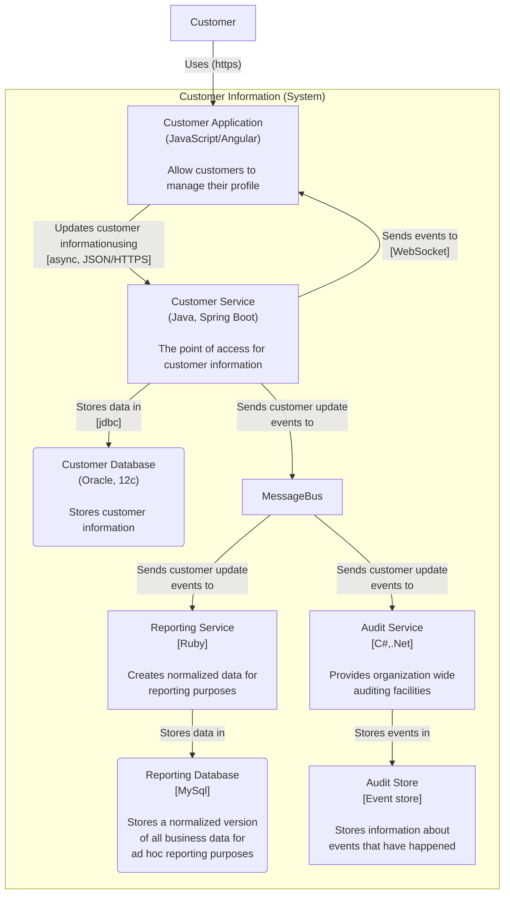
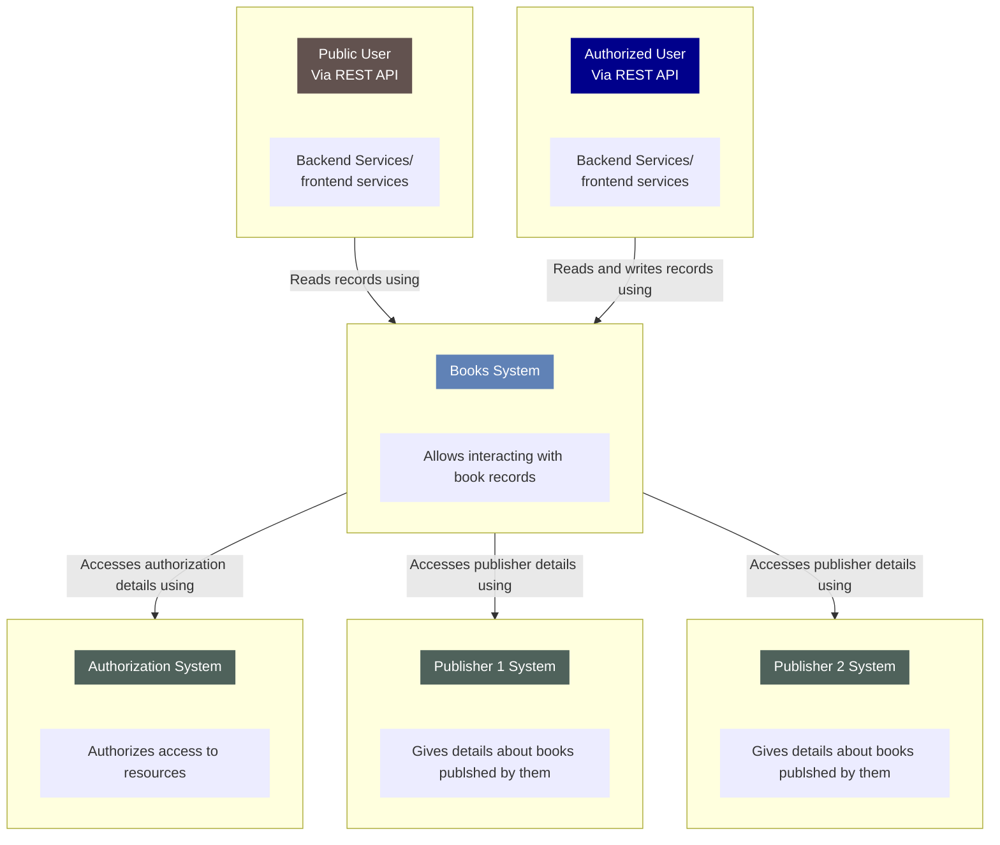

# C4 diagram using mermaid

<style>.mermaid svg { height: auto; }</style>

extrtact from discussions here : https://github.com/mermaid-js/mermaid/issues/1276

```text
graph TB
    Customer--"Uses (https)"-->CustomerApp("Customer Application")
    subgraph "Customer Information (System)"
    CustomerApp["Customer Application<br/>(JavaScript/Angular)<br/><br/>Allow customers to manage their profile"]--"Updates customer informationusing<br/>[async, JSON/HTTPS]"-->CustomerService["Customer Service<br/>(Java, Spring Boot)<br/><br/>The point of access for customer information"]
    CustomerService--"Sends events to<br/>[WebSocket]"-->CustomerApp
    CustomerService--"Stores data in<br/>[jdbc]"-->CustomerDatabase("Customer Database<br/>(Oracle, 12c)<br/><br/>Stores customer information")
    CustomerService--"Sends customer update<br/>events to"-->MessageBus
    MessageBus--"Sends customer update<br/>events to"-->ReportingService
    MessageBus--"Sends customer update<br/>events to"-->AuditService["Audit Service<br/>[C#,.Net]<br/><br/>Provides organization wide<br/>auditing facilities"]
    ReportingService["Reporting Service<br/>[Ruby]<br/><br/>Creates normalized data for<br/>reporting purposes"]--"Stores data in"-->ReportingDatabase("Reporting Database<br/>[MySql]<br/><br/>Stores a normalized version<br/>of all business data for<br/>ad hoc reporting purposes")
    AuditService--"Stores events in"-->AuditStore["Audit Store<br/>[Event store]<br/><br/>Stores information about<br/>events that have happened"]
    end
```

## produces







<div style='width:130px'>
Legend
<div style='background-color:#00008B;color:white'>Support team</div>
<div style='background-color:#555555;color:white'>External system</div>
<div style='background-color:#DD0044;color:white'>Sitecore</div>
</div>
